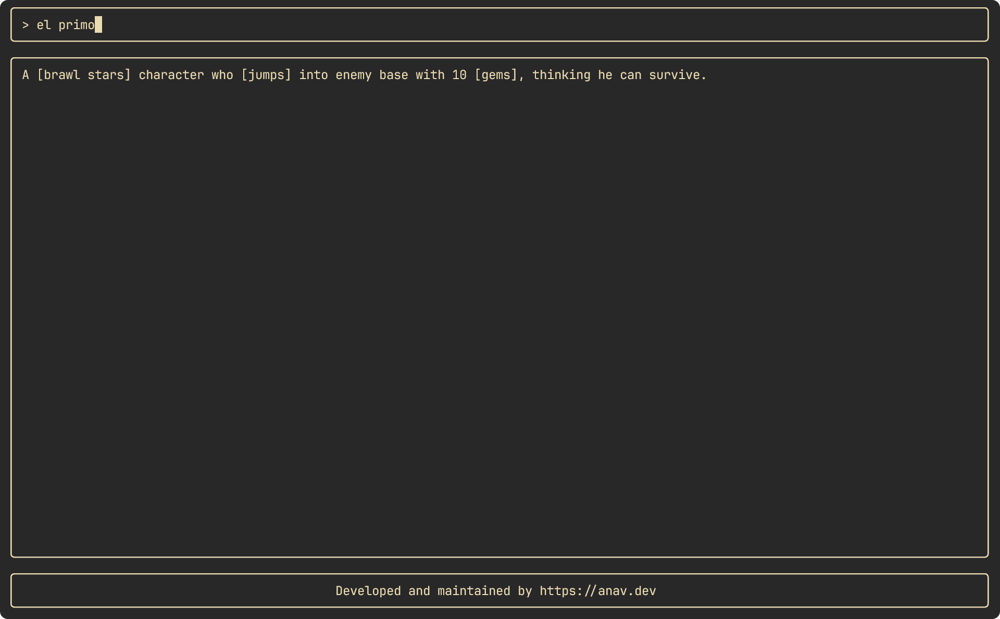

# Terminal Dictionary 📘



This is a simple TUI (terminal user interface) that allows users to search for the definitions of words. The TUI itself is built using various libraries offered by [Charm](https://charm.sh). After entering a search term, the app fetches the definition from teh Urban dictionary API and displays it.

## Technologies Used

- Bubbles (component)
- LipGloss (layout)
- Bubble Tea (framework)
- Urban Dictionary API

## Getting Started

Windows users can directly download the TUI from the [releases page](https://github.com/anav5704/terminal-dictionary/releases/tag/v0.0.0).

If you want to build the TUI yourself, make sure you have [Go](https://go.dev) installed. Then fork and clone this repo. Once you have the source code, build the app using the following command:

```go
go build
```

Then install it:

```go
go install
```

Finally, run it using:

```shell
terminal-dictionary
```

## Learning Resources

- [Bubble Tea architecture](https://www.youtube.com/watch?v=ERaZi0YvBRs)
- [Bubble Tea tutorial](https://www.youtube.com/watch?v=DEeFnVj3cv8)
- [Bubble Tea docs](https://github.com/charmbracelet/bubbletea)
